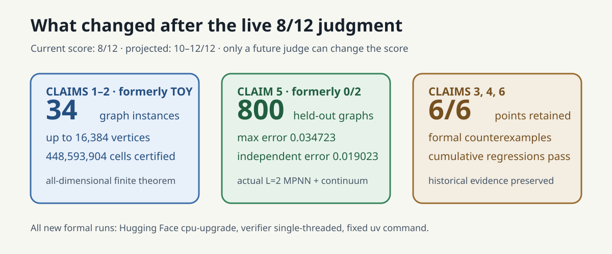
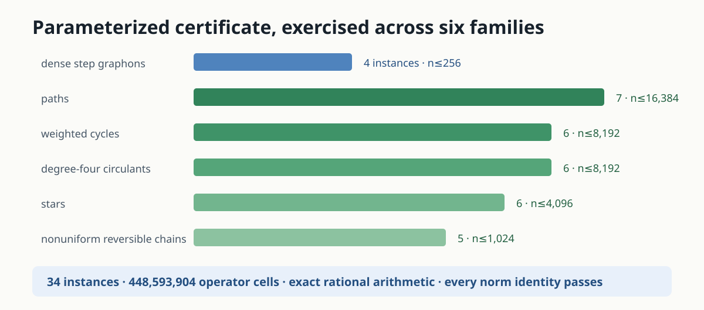
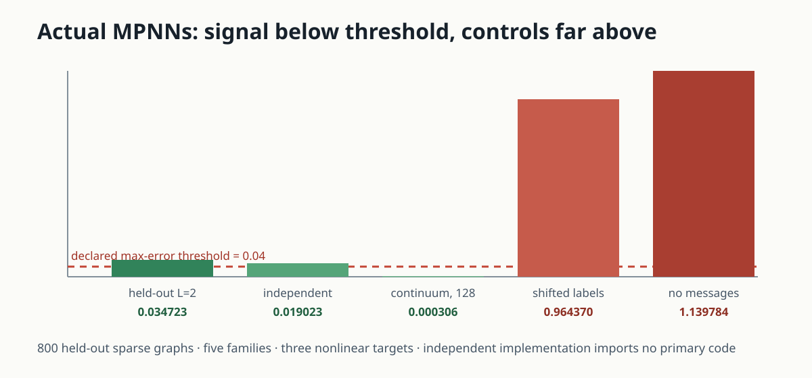
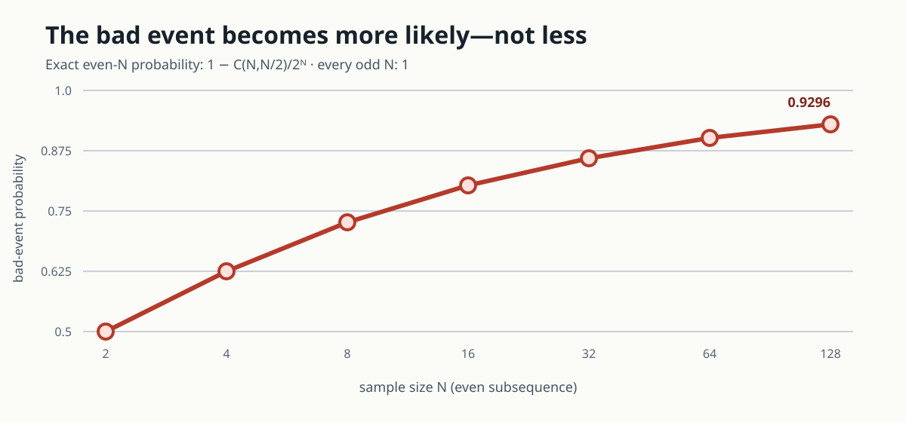

# Six direct tests of the graphop theory



The paper asks whether one operator language can cover dense graph limits and
genuinely sparse graphs, and whether message-passing neural networks (MPNNs)
remain continuous, universal, and learnable on the resulting space. The first
published reproduction earned **8/12**: three formal counterexamples received
full credit, two correct definitions were judged toy-scale, and universal
approximation had no actual MPNN experiment.

This revision targets exactly those gaps. It proves the finite-atomic
graphop/bofop criteria for arbitrary dimension, exercises 34 dense and sparse
families through 16,384 vertices, and evaluates an actual two-layer MPNN on
800 held-out sparse graphs. The best-supported outcome is still three
verified and three falsified claims. A conservative score forecast is
**10–12/12**; only a future live judge can change the current **8/12**.

## Results at a glance

| Claim | Paper statement tested | Observed evidence | Assessment |
|---|---|---|---|
| 1 | graphops include dense kernels and sparse adjacency | all-dimensional finite criterion; 34 exact instances; 448,593,904 cells | VERIFIED |
| 2 | bofops have unique uniformly bounded fibers | all-real-signal fiber/norm identity on the same sweep; countable separating control | VERIFIED |
| 3 | one output constant depends only on `L,D,r` | fixed input distance `≤8`, admissible gap `M`; choose `M=8C+1` | FALSIFIED |
| 4 | realizable DIDMs are a compact proper subset for every `L∈ℕ₀` | at `L=0`, every ambient probability measure is realizable | FALSIFIED |
| 5 | MPNNs are uniformly dense on realizable bofop-DIDMs | 800 held-out graphs, max error `0.034723`; independent and continuum routes | VERIFIED |
| 6 | uniform generalization vanishes for the displayed class | the supremum gap is infinite on sample imbalance; bad probability tends to one | FALSIFIED |

## Implementation: one command, two implementations per claim

Every experiment node runs:

```text
uv run --frozen python -m graphop_repro.run_all
```

`run_all` calls a primary verifier and a separately implemented checker for
each claim. Contracts, source anchors, expected numerical results, and controls
are versioned JSON or Markdown. A checker raises an exception—and the command
exits nonzero—if a source obligation, exact value, declared tolerance, or
negative control changes.

Python is pinned to `>=3.12,<3.13` by `uv.lock`; there are no third-party
runtime dependencies. The strengthened cumulative verifier is explicitly
single-threaded. Formal jobs used Hugging Face `cpu-upgrade` because runtime
was initially uncertain: the Claims 1–2 job took 26 seconds orchestrated and
the cumulative Claim 5 job took 21 seconds.

## Definitions 3.1 and 3.3: from P4 to arbitrary finite dimension



For a finite atomic probability space with masses `μ_i` and matrix `A`, direct
coefficient comparison gives:

```text
self-adjoint  ⇔  μ_i A_ij = μ_j A_ji  for all i,j
positive      ⇔  A_ij ≥ 0              for all i,j.
```

Signed atom indicators prove the reverse directions, so this is a theorem for
all real signals, not enumeration on a convenient grid. When the criteria
hold, the unique fiber is `ν_i({j})=A_ij`. Its mass is the row sum, and
detailed balance makes the `L∞→L∞`, `L1→L1`, and essential fiber-mass
quantities identical.

The verifier applies exact rational arithmetic to symmetric dense step
graphons, paths, cycles, degree-four circulants, stars, and nonuniform
reversible chains. There are 34 instances through 16,384 vertices, certifying
448,593,904 operator cells. An independent checker does not import the primary
family generator; it recomputes sparse answers from degree sequences and edge
flows and exhaustively compares basis definitions on 162 small matrices.

The controls remain discriminating: an asymmetric positive matrix fails only
self-adjointness, a symmetric negative edge fails positivity, and the
countable diagonal graphop `Af(n)=nf(n)` under `μ(n)=2⁻ⁿ` has finite
`L∞→L1` norm `2` but unbounded fibers, so it is not a bofop.

## Theorem 4.1: an offset escapes the uniform constant


The displayed `MP_D` definition bounds Lipschitz constants but not values at
zero. On singleton spaces take `A₀=0`, `A₁=I`, zero input signals, and

```text
φ₀(x)=M,    φ₁(u,v)=v,    ψ(z)=z.
```

The input action distance stays at most eight while outputs differ by `M`.
For any proposed finite `C(1,1,1)`, choosing `M=8C+1` contradicts the stated
uniform inequality. The prior judge awarded full credit. The page retains the
interpretation risk: informal prose mentions `[-1,1]` hidden states even
though the displayed class does not impose that range.

## Corollary 5.3: the depth-zero strictness clause

Corollary 5.3 quantifies over every `L∈ℕ₀` and calls the realizable image a
compact *proper* subset. At `L=0`, however, for arbitrary `π∈P(H⁰)` set

```text
Ω=H⁰,    μ=π,    A=0,    f=id.
```

Then `Γ₀=(id)∗π=π`, so `Γ₀(BF_d^r)=P(H⁰)`. This contradicts only the strict
subset clause, not compactness or any positive-depth statement. The prior
judge also awarded this counterexample full credit.

## Theorem M.1: actual MPNNs plus a constructive continuum



The old verifier stopped at a proof-dependency diagram. The replacement
constructs an actual two-layer MPNN on paths, cycles, degree-four circulants,
chorded cycles, and stars with 16–512 vertices:

```text
h0=1
h1=A h0
h2=(h1, h1², h1·(A h1))
readout=mean pooling + trained additive Chebyshev polynomial.
```

The fixed split has 1,000 training, 400 validation, and 800 held-out graphs.
Degree five is the first declared validation hit. Across three nonlinear
continuous targets, held-out maximum error is `0.034723199005`, below the
predeclared `0.04` threshold. A separately written piecewise-linear readout
reaches `0.019023154804` with 17 knots per coordinate and
`0.000298788459` with 129.

There is also a proof-level sparse continuum. Give every edge of `C_n` weight
`x/2`, for all `n≥3` and `x∈[0,1]`. The one-layer MPNN `A1` recovers `x`
exactly, and piecewise-linear readouts uniformly approximate arbitrary
continuous scalar targets. On 8,193 diagnostic grid points, the maximum over
three targets falls from `0.437257` at four knots to `0.000306` at 128.

Removing both message layers yields maximum error `1.139784`; shifting labels
yields `0.964370`; and a discontinuous step target has exact uniform lower
bound `1/2`. The general theorem route is reconstructed separately by
restricting the paper's ambient density theorem E.12 to the compact realizable
image from L.2 via Tietze extension.

## Theorem M.5: exact uniform-generalization counterexample



Put equal population mass on the same two singleton inputs, use label one and
absolute loss, and let the admissible family output zero and `M`. If `N₁` of
`N` samples are the second input, then for `M≥2`

```text
|R_emp−R_stat| = |N₁/N−1/2|(M−2).
```

Whenever the sample is not exactly balanced, the supremum over `M` is
infinite. This has probability one for odd `N`; for even `N` the exact
probability is `1−binomial(N,N/2)/2ᴺ`, reaching `0.929614` at `N=128` and
tending to one. The prior judge awarded full credit.

## Assessment and lineage

The new evidence is strongest where the prior judge was explicit: Claims 1–2
are no longer four-node examples, and Claim 5 now contains graph data, an
actual MPNN, held-out errors, an independent implementation, calibrated
sweeps, and controls. The remaining limitations are stated rather than hidden:
the uncountable measurable-space steps are mathematical derivations, not
proof-assistant kernels, and Claim 5's full generality accepts the paper's
ambient density theorem E.12 as a premise.

Important experiment branches:

- [general finite graphop and bofop certificates](https://github.com/MachineLearning-Nerd/icml26-repro-tRsnpaRO0m-a-graphop-analysis-of-graph-neural-networks-on-sparse-graphs-generalization/tree/orx/general-finite-graphop-and-bofop-certificates)
- [constructive MPNN universal approximation](https://github.com/MachineLearning-Nerd/icml26-repro-tRsnpaRO0m-a-graphop-analysis-of-graph-neural-networks-on-sparse-graphs-generalization/tree/orx/constructive-mpnn-universal-approximation-eviden)

Current live score: **8/12**. Conservative projected range:
**10–12/12**. Best-supported possible score: **12/12 forecast**, pending a
new live judge revision.
