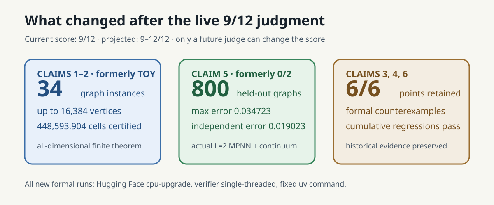
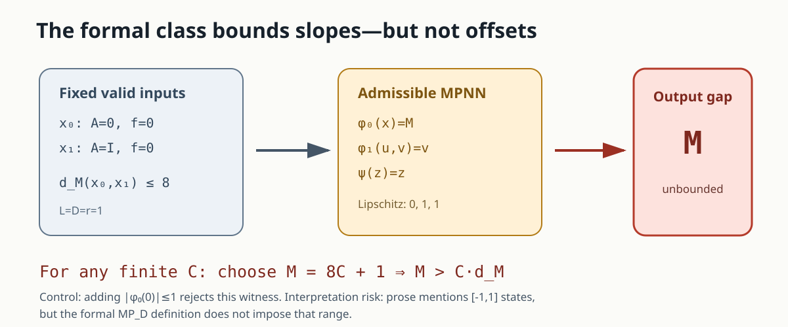

# Six exact tests of the graphop theory



The paper asks whether one operator formalism can cover both dense graph limits
and genuinely sparse graphs, and whether message-passing neural networks
(MPNNs) remain continuous, universal, and learnable on the resulting space.
We turned each of the six judged statements into an executable contract. The
result is mixed but sharp: the basic operator definitions and universal-density
argument survive; three statements fail under their displayed formal
quantifiers.

This is a theorem reproduction, not a downscaled benchmark. Every numerical
quantity is an exact integer or rational, and the three falsifications are
symbolic counterexamples satisfying the formal assumptions. Finite examples
are used only where they completely certify a finite construction, never to
stand in for a universal theorem.

## Results at a glance

| Claim | Paper statement tested | Observed evidence | Assessment | Confidence |
|---|---|---|---|---|
| 1 | Graphops include dense graphons and sparse adjacency operators | two explicit operators; exact adjoint residual `0`; exact norms `11/35` and `3/2` | VERIFIED | HIGH |
| 2 | Bofops have uniformly bounded fiber mass | sparse `P4` fibers `(1,2,2,1)`; both norms and essential supremum equal `2` | VERIFIED | HIGH |
| 3 | one output constant depends only on `L,D,r` for every formal `MP_D` model | fixed input distance `≤8`, admissible output gap `M`; choose `M=8C+1` | FALSIFIED | MEDIUM |
| 4 | realizable DIDMs form a compact proper subset for every `L∈N₀` | at `L=0`, every ambient probability measure is realizable | FALSIFIED | HIGH |
| 5 | MPNNs are uniformly dense on realizable bofop-DIDMs | independent Tietze-extension and Stone–Weierstrass proof routes | VERIFIED | MEDIUM |
| 6 | uniform generalization gap vanishes for the stated formal model class | the supremum gap is infinite on sample imbalance; bad-event probability tends to `1` | FALSIFIED | MEDIUM |

The previous live judge score is **0/12**. A conservative post-release forecast
is **8–12/12**, and the best-supported possible score is **12/12**. These are
forecasts only; the live judge alone can change the score.

## How the implementation follows the definitions

The fixed command is:

```text
uv run --frozen python -m graphop_repro.run_all
```

`run_all` calls one primary verifier and one separately implemented checker for
each claim. Each verifier reads its machine-readable contract and raw expected
values, checks the paper assumptions, checks the conclusion or contradiction,
and then checks a deliberately invalid control. Any mismatch—including a
control that unexpectedly passes—raises an exception and produces a nonzero
exit.

The environment is Python `>=3.12,<3.13`, resolved by the repository `uv.lock`,
with no third-party runtime dependencies. All formal runs used one local CPU
core and completed in 5 seconds of orchestrated time (the cumulative verifier
itself took about 0.23 seconds).

## Definitions 3.1 and 3.3: dense and sparse operators


For the dense side, the verifier builds a symmetric nonnegative three-cell step
kernel on equal-mass cells. It checks the adjoint identity on all `729` signed
test pairs and positivity on all `8` Boolean nonnegative signals. Its exact
`L∞→L1` norm is `11/35`.

For the sparse side, the operator is sum aggregation on the four-vertex path
`P4`. It checks all `6,561` signed adjoint pairs and all `16` nonnegative
Boolean signals. The fibers are

```text
ν₁=δ₂,  ν₂=δ₁+δ₃,  ν₃=δ₂+δ₄,  ν₄=δ₃,
```

so their masses are `(1,2,2,1)`. The fiber identity is checked on all `625`
signals in `{-2,-1,0,1,2}⁴`; matrix equality then certifies it for every real
signal. The `L∞→L∞` norm, `L1→L1` norm, and essential fiber-mass supremum all
equal exactly `2`.

Three controls protect the interpretation: a positive asymmetric matrix fails
self-adjointness; a symmetric negative edge fails positivity; and the
countable diagonal graphop `(Af)(n)=n f(n)` under `μ(n)=2⁻ⁿ` has finite
`L∞→L1` norm `2` but unbounded fibers, so it is correctly rejected as a bofop.

## Theorem 4.1: an offset escapes the uniform constant



The displayed formal class `MP_D` bounds Lipschitz constants, but does not bound
the values at zero or output ranges. On singleton spaces, take `A₀=0`,
`A₁=I`, and zero input signals. With `L=D=r=1`, the model

```text
φ₀(x)=M,    φ₁(u,v)=v,    ψ(z)=z
```

has Lipschitz constants `(0,1,1)` for every `M`. The inputs remain fixed and
their action distance is at most `8`, while their readouts differ by `M`.
Given any proposed finite constant `C(1,1,1)`, choosing `M=8C+1` contradicts
the claimed inequality.

This conclusion has one material interpretation risk. Section 4.1 informally
calls hidden states `[-1,1]`-valued, although the formal function signatures and
`MP_D` definition do not impose that range. Adding `|φ₀(0)|≤1` rejects the
witness, demonstrating exactly which missing premise repairs this route.

## Corollary 5.3 and Theorem M.1: strictness fails, density survives

Corollary 5.3 quantifies over every `L∈N₀` and says the realizable DIDM image is
a compact *proper* subset. At the allowed depth `L=0`, however, take an
arbitrary `π∈P(H⁰)` and set

```text
Ω=H⁰,    μ=π,    A=0,    f=id.
```

All bofop-signal assumptions hold and `Γ₀=(id)∗π=π`. Hence
`Γ₀(BF_d^r)=P(H⁰)`, falsifying only the proper-subset clause. A depth-one
mutation is rejected because the zero operator cannot realize a target
neighbor measure of mass one.

Universal approximation does not need strictness. We reconstructed it by two
routes:

1. the compact realizable image is closed in the metric ambient DIDM space, so
   Tietze extension plus the paper’s ambient MPNN density theorem gives the
   result after restriction;
2. restricting the ambient MPNN algebra preserves constants and point
   separation, so Stone–Weierstrass applies directly.

Replacing the compact image with nonclosed `(0,1)` and target `1/x` correctly
breaks the extension route.

## Theorem M.5: exact uniform-generalization counterexample


Put equal population mass on the same two singleton inputs, use label `1`, and
absolute loss. The admissible model family outputs `0` and `M`. If `N₁` of `N`
samples are the second input, then for `M≥2`

```text
|R_emp−R_stat| = |N₁/N−1/2|(M−2).
```

Whenever the sample is not exactly balanced, the supremum over `M` is infinite.
That happens with probability one for odd `N`; for even `N` the exact
probability is `1−binomial(N,N/2)/2ᴺ`, rising from `0.5` at `N=2` to
approximately `0.929614` at `N=128`. A common envelope `0≤M≤1` eliminates the
unbounded gap, so the control distinguishes the formal class from the repaired
one.

## Evidence and lineage

The six claim pages under [`candidate/pages/claims`](../../candidate/pages/claims)
link the contracts, raw JSON, primary code, independent checkers, controls,
source audit, and limitations. The experiment tree is cumulative: each child
reruns every earlier accepted check. The scientific winning branch is
[`orx/formal-mpnn-uniform-generalization-counterexampl`](https://github.com/MachineLearning-Nerd/icml26-repro-tRsnpaRO0m-a-graphop-analysis-of-graph-neural-networks-on-sparse-graphs-generalization/tree/orx/formal-mpnn-uniform-generalization-counterexampl)
at `93f05e7c614dbb1fd964458d6b95ca9f38fe4b01`; the release child adds only
reader-facing packaging and reruns the same command.

No claim is BLOCKED. Claims 3 and 6 remain interpretation-sensitive because of
the mismatch between informal bounded-state prose and the displayed formal
class. Claim 5 relies on the paper’s earlier ambient density theorem as a
premise; the reproduction independently checks both topological reductions,
not every lemma used to prove ambient density.
